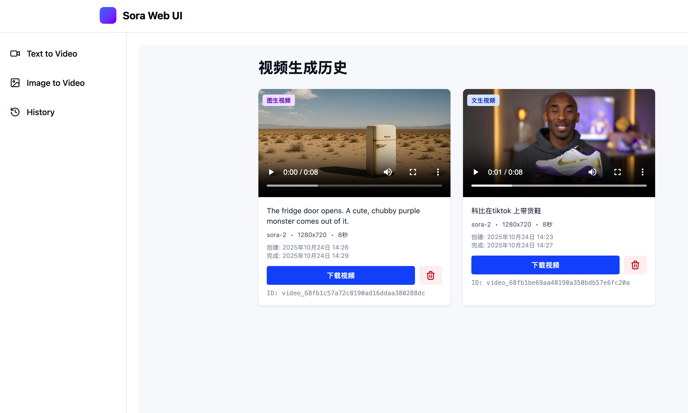

# Sora Web UI

一个基于 Azure OpenAI Sora 2 的 Web 视频生成界面，支持文本生成视频（Text to Video）和图片生成视频（Image to Video）功能。


## ✨ 功能特性

- 🎬 **文本生成视频** - 通过文字描述生成高质量视频
- 🖼️ **图片生成视频** - 上传图片，AI 将其转换为动态视频
- 📊 **实时进度跟踪** - 可视化显示视频生成进度，带火花动画效果
- 📜 **历史记录管理** - 查看、下载和管理所有生成的视频
- 🎥 **视频预览播放** - 在历史页面直接预览和播放生成的视频
- ⚙️ **配置管理** - 灵活配置 Azure OpenAI 连接信息
- 🎨 **现代化 UI** - 基于 Tailwind CSS 的美观界面设计



## 🏗️ 技术栈

### 前端
- **React 18** + **TypeScript**
- **Vite** - 快速的构建工具
- **Tailwind CSS** - 实用优先的 CSS 框架
- **Zustand** - 轻量级状态管理
- **Axios** - HTTP 客户端
- **Lucide React** - 图标库

### 后端
- **Node.js** + **Express**
- **TypeScript**
- **OpenAI SDK** - Azure OpenAI 集成
- **Multer** - 文件上传处理
- **Sharp** - 图片处理

## 📋 前置要求

- **Node.js** >= 18.0.0
- **npm** >= 9.0.0
- **Azure OpenAI 账号** 并开通 Sora 2 服务

## 🚀 快速开始

### 1. 克隆项目

```bash
git clone https://github.com/nikawang/sora2-ui.git
cd sora2-ui
```

### 2. 安装依赖

项目包含前端和后端两部分，需要分别安装依赖：

```bash
# 安装后端依赖
cd src/backend
npm install

# 安装前端依赖
cd ../frontend
npm install
```

### 3. 配置环境变量

在 `src/backend` 目录下创建 `.env` 文件（可选）：

```env
# 服务器配置
PORT=8080
```

> 💡 **提示**：如果不在环境变量中配置，也可以在启动后通过 Web 界面的设置页面进行配置。

### 4. 启动项目

#### 方式一：使用启动脚本（推荐）

```bash
# 在项目根目录运行
chmod +x start-all.sh
./start-all.sh
```

这个脚本会自动：
- 启动后端服务（端口 8080）
- 启动前端服务（端口 5173）
- 输出日志到 `backend-output.log` 和 `frontend-output.log`

#### 方式二：手动启动

**启动后端**：
```bash
cd src/backend
npm run dev
```

**启动前端**（新开一个终端）：
```bash
cd src/frontend
npm run dev
```

### 5. 访问应用

打开浏览器访问：
- **前端界面**：http://localhost:5173
- **后端 API**：http://localhost:8080

## 🎯 使用指南

### 首次使用

1. **配置 Azure OpenAI**
   - 点击右上角的设置图标（⚙️）
   - 输入你的 Azure OpenAI Endpoint 和 API Key
   - 点击"Save Configuration"保存并验证连接

2. **生成视频**
   
   **文本生成视频**：
   - 导航到"Text to Video"页面
   - 输入视频描述提示词
   - 选择视频参数（分辨率、时长、模型）
   - 点击"Generate Video"

   **图片生成视频**：
   - 导航到"Image to Video"页面
   - 上传图片（支持 jpg, png, webp）
   - 可选：输入运动描述
   - 选择视频参数
   - 点击"Generate Video"

3. **查看历史**
   - 导航到"History"页面
   - 查看所有生成的视频
   - 直接在线预览播放
   - 下载视频到本地
   - 删除不需要的记录

## 📁 项目结构

```
sora2-ui/
├── src/
│   ├── backend/                 # 后端服务
│   │   ├── src/
│   │   │   ├── controllers/     # 控制器
│   │   │   ├── services/        # 业务逻辑
│   │   │   ├── routes/          # 路由
│   │   │   ├── middleware/      # 中间件
│   │   │   └── server.ts        # 服务器入口
│   │   ├── uploads/             # 上传文件目录
│   │   ├── videos/              # 生成的视频目录
│   │   └── package.json
│   │
│   └── frontend/                # 前端应用
│       ├── src/
│       │   ├── components/      # React 组件
│       │   ├── pages/           # 页面组件
│       │   ├── services/        # API 服务
│       │   ├── hooks/           # 自定义 Hooks
│       │   ├── store/           # Zustand 状态管理
│       │   └── App.tsx          # 应用入口
│       └── package.json
│
├── start-all.sh                 # 启动脚本
└── README.md                    # 项目文档
```

## 🎨 支持的视频参数

### 分辨率选项
- `1280x720` - 720p 横屏
- `720x1280` - 720p 竖屏（适合手机）
- `1792x1024` - 宽屏横屏
- `1024x1792` - 高屏竖屏

### 时长选项
- `4秒` - 快速短视频
- `8秒` - 标准时长
- `12秒` - 扩展时长

### 模型
- `sora-2` - Sora 第二代模型

## 🔧 开发指南

### 后端开发

```bash
cd src/backend
npm run dev          # 开发模式（热重载）
npm run build        # 编译 TypeScript
npm run start        # 生产模式
```

### 前端开发

```bash
cd src/frontend
npm run dev          # 开发服务器
npm run build        # 构建生产版本
npm run preview      # 预览生产版本
```

## 🐛 故障排查

### 端口已被占用

如果 8080 或 5173 端口被占用：

```bash
# 查找占用端口的进程
lsof -i :8080
lsof -i :5173

# 或使用 netstat
netstat -tulpn | grep 8080
netstat -tulpn | grep 5173

# 杀死进程
kill -9 <PID>
```

### 后端无法启动

1. 检查 Node.js 版本：`node --version`（需要 >= 18）
2. 清理依赖重新安装：
   ```bash
   cd src/backend
   rm -rf node_modules package-lock.json
   npm install
   ```

### 视频生成失败

1. **检查 Azure OpenAI 配置**
   - 确保 Endpoint 和 API Key 正确
   - 在设置中测试连接是否成功

2. **查看后端日志**
   ```bash
   tail -f backend-output.log
   ```

3. **检查网络连接**
   - 确保可以访问 Azure OpenAI 服务
   - 检查防火墙设置

## 📝 API 文档

### 主要端点

- `GET /api/tasks` - 获取所有任务
- `POST /api/tasks/text-to-video` - 提交文本生成视频任务
- `POST /api/tasks/image-to-video` - 提交图片生成视频任务
- `GET /api/tasks/:taskId/status` - 获取任务状态
- `DELETE /api/tasks/:taskId/delete` - 删除任务
- `POST /api/config/validate` - 验证配置
- `GET /api/files/video/:filename` - 下载视频文件

## 🤝 贡献

欢迎提交 Issue 和 Pull Request！

## 📄 许可证

MIT License

## 📧 联系方式

如有问题或建议，请提交 Issue。

---

**享受 AI 视频创作的乐趣！** 🎬✨
